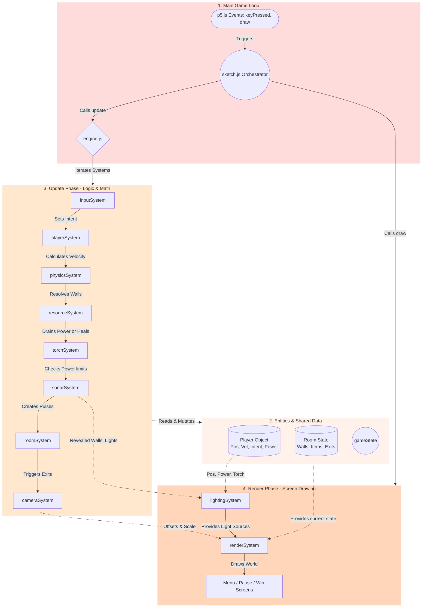
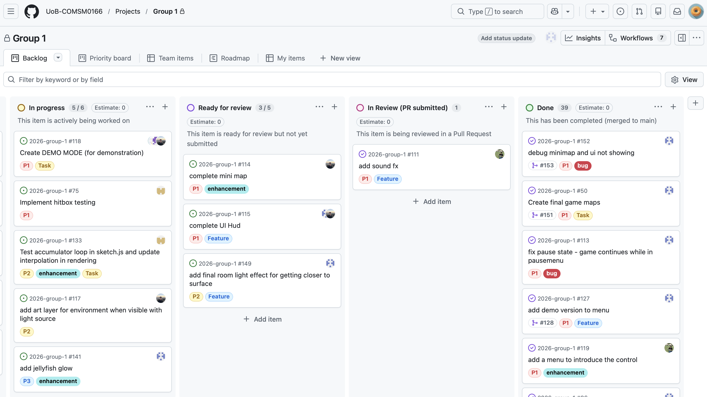

<html>
	<body style="text-align: center;">
		<div align="center">
		   <h1> University  of  Bristol <br/>
		   COMSM0166 - Group 1 (2026) <br/></h1>
		</div>
		<div align="center">
		   <h2> THE ABYSS </h2> 
			Somewhere above the surface awaits <br/><br/>
			[ADD PROMO IMAGE]
		</div>
		<div align="center">
 			<h3 align=center><a href="https://uob-comsm0166.github.io/2026-group-1/">Play Current Version - V4</a></h3>
		</div>
	</body>
</html>


### Video DEMO v4 (2-3 mins long max)
*(updated 05/03/26)*

https://github.com/user-attachments/assets/511bb68b-5e3b-4c63-b410-d253316b1b56

<br/>


# Our Team - Group 1


</br>

|Name|Email|Role|
|:-|:-|:-|
|Archie Brown|cq25988@bristol.ac.uk| UI and Upgrade Systems, CameraSystem and transition effects, VFX |
|Monal Gupta|ta25702@bristol.ac.uk| EnemySystem; ResourceManagmentSystem, Menus, Sound FX |
|Ben Mounce|wv25183@bristol.ac.uk| SonarSystem, MissileSystem & visuals |
|Georgia Sweeny|dp25498@bristol.ac.uk| Lead developer; Systems Architect; Lighting Systems & effects; Code reviewer, GameWorld Design |
|Nick Jankov|ve21144@bristol.ac.uk| HitboxSystem, Code Reviewer |
|Jude Hsu|ca20853@bristol.ac.uk| Report contributor; Co-developer; PauseMenu |

</br>


---
</br>


# Project Report

## 1. Introduction
- 5% ~250 words 
- Describe your game, what is based on, what makes it novel? (what's the "twist"?)

The Abyss is a tense underwater, Metroidvania-style game with a playful blocky aesthetic, focused on exploration and challenging resource management in near-complete darkness.

When a deep sea scientific expedition takes a sudden turn after the submersible suffers a major malfunction, the player is left stranded deep within the abyss and must find a way back to the surface from an unknown location. Like traditional Metroidvania games, progression is based on exploration, mastery of abilities, and unlocking tools that grant access to previously unreachable areas. Players are frequently placed in situations where they must quickly learn the layout of the environment and identify hazards in order to survive and progress. The game also supports multiple playstyles through system upgrades and missile-based combat, allowing players to either adopt a cautious, navigation-focused approach or play more aggressively by using salvaged scrap to craft missiles and eliminate threats.

Rather than being a gimmick, the setting directly supports the core mechanic and central twist: a sonar-based navigation system. Instead of constant visibility, players use sonar to temporarily reveal surrounding areas. A limited torch system is also available, but it acts as a trade-off, draining the player’s already scarce power resource. In addition, the game features a sonar-based minimap system, which gradually updates as the player explores. This minimap is revealed through both sonar scans and torch usage, reinforcing the player’s understanding of explored and unexplored areas over time. Together, these systems create a gameplay loop based on scanning, interpretation, and memory rather than continuous vision, making movement deliberate and uncertain. Although set in darkness, the abyss is far from empty, with bioluminescent jellyfish, glowing biomatter, and salvage from the surface scattered throughout the environment to encourage exploration and risk-taking.

The game also features a resource management and upgrade system. Players must manage limited power while navigating environmental hazards and interacting with objects that can either assist or hinder progression. This reinforces a consistent risk–reward structure, where deeper exploration offers greater rewards but increases danger. With the ultimate goal of returning to the surface, every decision carries weight.

Overall, the game combines traditional Metroidvania design principles with a sonar-based visibility and mapping system alongside resource management mechanics. This reshapes how players perceive and interact with the environment, while maintaining a focus on progression through exploration and discovery.

## 2. Requirements 
### 2.1 Early Stage Design & Ideation
We were inspired by classic flash games from our childhood like; Club Penguin's Aqua Grabber, Motherload as well as modern titles, Hollow Knight and Subnautica. The game concept was developed collaboratively through group discussions and pitch proposals. During the early design phase, we used [Notion](https://www.notion.so/Software-Engineering-Project-2eef3902b1f080668320f5a1a2d17915)to document and refine ideas. Each team member proposed a concept [Figure 1: Game Ideas], and the team then voted on their preferred option [Figure 2: Poll Results for Game Ideas]. Two of the proposed concepts were centred on echolocation, which helped establish it as the foundation of the project. Through further discussion, the selected concept evolved into an underwater exploration game, where limited visibility creates tension and supports the overall atmosphere. The game’s core differentiator is its sonar-based mechanic, supported by darkness and resource management systems.

``` jude: Please check that non-members can access the Notion link before submission.```

<table align="center">
  <tr>
    <td align="center">
      <br>
      <sub>Figure 1: Game Ideas</sub>
    </td>
    <td align="center">
      <br>
      <sub>Figure 2: Poll Results for Game Ideas</sub>
    </td>
  </tr>
</table>

### 2.2 Paper Prototypes
In the early stage of development, we created a paper prototype to visualise and test the flow of the game’s core mechanics. This stage allowed the team to explore the overall layout of the game and discuss key design elements such as enemies, player objectives, setting, and what would make the game engaging. Paper prototyping also provided a low-cost way to experiment with ideas before moving into implementation.

We later asked testers to play through the prototype and share feedback. Their responses helped identify the most engaging aspects of the design, with the echolocation mechanic receiving particularly positive reactions. Testers highlighted the tension created by limited visibility and sonar use, which helped validate both the core mechanic and the underwater setting.

Based on this feedback, the team shaped the game around exploration, tension, and careful resource use. A Metroidvania-inspired structure was chosen to support these goals, allowing progression through interconnected spaces, restricted areas, and gradual access to new abilities. This worked well with the sonar mechanic, as players needed to decide when to reveal their surroundings and when to conserve resources. Overall, the paper prototyping stage helped clarify the game’s direction and confirmed that its main appeal lies in atmosphere, uncertainty, and controlled exploration.

<p align="center">
  
</p>

### 2.3 Stakeholders - Onion Model
<p align="center">
    
</p>

### 2.4 Epics and User Stories
We used epics and user stories to structure the game concept into a clear and manageable development plan. At the start of the project, the overall design was too broad, so epics were used to organise development into key areas of player experience and technical functionality. These included player movement, resource management, sonar and lighting systems, enemies, world progression, interface design, and system architecture.

For each epic, features were defined primarily from the perspective of the player, and in some cases from the perspective of the developer. This encouraged consideration of why each feature was important, rather than focusing solely on implementation.

Acceptance criteria were also defined to establish what “complete” meant for each feature. This made requirements more concrete, reduced ambiguity during development, and supported prioritisation between core MVP features and lower-priority enhancements.

Overall, epics and user stories were most effective when kept practical and closely aligned with gameplay systems. They helped maintain a focus on player experience while improving clarity in planning and implementation priorities.

### EPIC 1 – Core Player Interaction
**Description:** The player must move, explore, and interact with the underwater world intuitively. 

**User Stories:**  
- As a player, I want responsive movement so that I feel in control while navigating underwater.
- As a player, I want to navigate vertical space so that I can fully explore the environment.
- As a player, I want intuitive controls so that I can begin playing without a steep learning curve.
- As a player with accessibility needs, I want remappable controls so that I can play comfortably.

**Acceptance Criteria:**
- Movement and physics are independent of frame rate.
- Input handling is separated from game logic.
- Movement includes consistent drag and controlled vertical velocity limits.
- Controls can be remapped without affecting core gameplay systems.

### EPIC 2 - Resource & Survival Systems
**Description:** The player must manage limited resources to create tension and encourage strategic decision-making.

**User Stories:**  
- As a player, I want power to drain over time so that exploration feels increasingly risky.
- As a player, I want sonar and torch usage to consume additional power so that I must choose when to use them.
- As a player, I want health to decrease when colliding with enemies so that there are meaningful consequences for mistakes.
  
**Acceptance Criteria:**
- Resource values decrease continuously and consistently over time or usage.
- Game Over is triggered when any critical resource reaches zero.
- UI clearly displays all active resource levels at all times.
- Resource changes are immediately reflected in gameplay state.

### EPIC 3 – World Structure & Progression
**Description:** The world supports non-linear exploration and ability-based progression. 

**User Stories:**  
- As a player, I want interconnected rooms so that exploration feels cohesive.
- As a player, I want gated paths so that new abilities unlock new areas.

**Acceptance Criteria:**
- Multiple interconnected rooms with clear transitions.
- Progression is gated through unlockable abilities.
- Reaching the final area triggers a win state.

### EPIC 4 – Interface & Game States
**Description:** The interface clearly communicates game state and core systems.

**User Stories:**  
- As a player, I want an in-game UI displaying resources so that I can manage survival.
- As a player, I want clear game states (start, pause, win, loss) so that the game flow is understandable.

**Acceptance Criteria:**
- UI displays all active resource values consistently.
- Menus correctly pause and resume gameplay.
- Game Over and Win states trigger correctly.

### EPIC 5 – Technical Architecture & Maintainability
**Description:** The system is modular and scalable to support consistent gameplay and future development. 

**User Stories:**  
- As a developer, I want systems to be modular so that features can be developed and debugged independently.
- As a developer, I want all time-based behaviour to use deltaTime so that gameplay is consistent across frame rates.
- As a developer, I want logic and rendering to be separated so that systems like lighting and sonar can be extended.
  
**Acceptance Criteria:**
- Systems are modularised (Input, Physics, Resource, Lighting, Enemy).
- All time-dependent behaviour is frame-rate independent.
- Rendering is decoupled from game logic.
- A central update loop manages execution order.


In addition to the inital concept proposals, the lead developer documented discussion points from the ideation stage and produced sevearal early room sketches and map layouts. These drawings helped the team make abstract ideas more concrete, compare possible structures, and visualise how exploration and progression might work in practice. Selectd examples of the maps are included below.

<table align="center">
  <tr>
    <td align="center">
      <br>
      <sub>Figure 3: Game Map Sketch by Georgia Sweeny</sub>
    </td>
    <td align="center">
      <br>
      <sub>Figure 4: Game Map Sketch by Georgia Sweeny</sub>
    </td>
  </tr>
  <tr>
    <td align="center">
      <br>
      <sub>Figure 5: Initial Game World Sketch by Georgia Sweeny</sub>
    </td>
    <td align="center">
      <br>
      <sub>Figure 6: Demo World Map by Georgia Sweeny</sub>
    </td>
  </tr>
</table>

### 2.6 Prioritised Feature Breakdown
To keep the development manageable and technically feasible, this project followed a risk-managed development approach prioritisation strategy. Core mechanics were given priority over feature breadth so that the team members could first deliver a stable and playable MVP. The breakdown below is based on our user stories derived from our game Epics.

| **Priority**            | **Systems / Features**                                                   |
| ----------------------- | ------------------------------------------------------------------------ | 
| **HIGH (MVP)**          | Player controls (intents: movement, sonar ping, torch toggle)            |
|                         | Physics (underwater movement, drag, collisions, hitboxes)                |
|                         | Minimal gameplay UI (power meter, sonar cooldown, pause)                 | 
|                         | Resource management (power drain + torch drain, replen)                  |
|                         | Lighting system (darkness overlay + visibility masking)                  | 
|                         | Echolocation / Sonar system (pulse, circular reveal, fade-out, cooldown) | 
|                         | Core Metroidvania structure (3–5 rooms, 1 gate, basic traversal)         | 
| **MEDIUM (Core Depth)** | Room system (room objects, transitions, bounds)                          | 
|                         | Camera system (follow player, clamp to room)                             | 
|                         | Torch visual enhancement (improved lighting radius)                      | 
|                         | Enemy system (basic patrol / contact damage)                             | 
|                         | Enemy awareness to sonar (alert state within pulse radius)               | 
|                         | Exploration ability (double jump unlock, etc.)                           | 
|                         | Simple upgrade system (increase sonar range or power capacity)           | 
| **LOW (Stretch)**       | Save system (checkpoint-based)                                           | 
|                         | Achievement system (internal milestone tracking)                         | 
|                         | Advanced enemy AI (hunt behaviour, multi-state logic)                    | 
|                         | Sonar-reactive mini-boss encounter                                       | 
|                         | Environmental physics extensions (currents, pressure zones)              | 
|                         | Public player database / leaderboard                                     | 

---
## 3. Design

This section explains the final system architecture of the game and how it evolved during development. At the start of the project, we used the p5.js online editor to prototype individual features, and we initially expected the design to be described using more traditional object-oriented modelling. However, as the prototype grew, maintaining shared game state across separate features became increasingly difficult.

Instead of placing most behaviour inside a few large classes, the project developed into a more modular, system-oriented structure where game data, input, logic, rendering, and world state are separated into distinct responsibilities. The final design is therefore not strongly inheritance-based. The diagrams in this section explain the implemented architecture, focusing on shared state, system responsibilities, and runtime behaviour.

We also created a code architecture guide ([CODE_ARCHITECTURE_GUIDE.md](CODE_ARCHITECTURE_GUIDE.md)) to help team members understand the overall structure of the codebase and become familiar with the responsibilities of each system.

### 3.1 System Architecture
The project is built using a **modular, state-driven architecture** that separates **logic, rendering, input, and game world state.** Each system has a clear responsibility and operates on shared state in a controlled order. This simplifies our debugging work, allows independent testing, and reduces unintended side-effects when new features are added.

This **high-level architecture snapshot** illustrates the responsibilities of each system:

```
InputSystem        → intent
PlayerSystem       → apply intent (movement + jump)
PhysicsSystem      → resolve motion & collisions
ResourceSystem     → manage power drain & replenishment
TorchSystem        → torch state & power usage
SonarSystem        → pulse logic & detection + alerts
RoomSystem         → current room state & transitions
CameraSystem       → viewport tracking & clamping
LightingSystem     → visibility rules & masking
EnemySystem        → AI movement & reactions
RenderSystem       → draw visible state
Engine             → orchestrates
```

**Key separation of concerns:**
- **LightingSystem** decides what is visible 
- **RenderSystem** decides how it is drawn.
- **CameraSystem** determines which portion of the world is in view.
- **RoomSystem** manages which data is active for the current room.

This separation helps keep the game predictable, testable, and modular. It also supports incremental development of complex systems like sonar without destabilising rendering.

### 3.2 Structural Architecture Diagram

The structural architecture diagram below shows how the main runtime components are organised. Instead of focusing on inheritance relationships, it shows how the game loop, shared data, update systems, and render systems are separated and connected during execution.

The diagram is divided into four parts:

1. **Core loop and inputs**

    This part shows the entry points of the game. p5.js event functions such as `keyPressed` and `draw` are handled by `sketch.js`, which acts as the main orchestrator and calls the engine during each frame.

2. **Data / entities**

    This part shows the shared state used by the systems, including the player object, room data, and global game state. These objects mainly store information such as position, velocity, power, room layout, and current game status.

3. **Update phase / logic**

    This part shows the order in which gameplay systems update the shared state. The engine runs systems such as input, player movement, physics, resources, torch, sonar, room transitions, and camera updates in sequence.

4. **Render phase**

    This part shows how the updated state is converted into screen output. Lighting and render systems use the current player, room, sonar, and camera data to draw the visible game world and overlay screens.



### 3.3 Runtime Behavioural Flow: Sonar Activation

The structural architecture diagram shows how the main systems are connected. This behavioural flow shows how those systems cooperate during one core gameplay action: activating sonar.

<p align="center">
  
  <br>
    <sub>Figure 7: Runtime Behavioural Flow for Sonar Activation</sub>
</p>

This flow shows that sonar is not drawn directly from player input. The input first becomes an intent, then the relevant systems update resources, visibility, enemy behaviour, and rendering in sequence. This keeps the core mechanic modular and prevents rendering logic from being mixed with gameplay logic.


## 4. Implementation

Before tackling the core mechanics of our game, we established a foundational architecture using an Object-Oriented approach. All physical entities inherit from a base Hitbox class, ensuring a standardised method for position tracking and collision detection. Initial physics implementation proved difficult, particularly maintaining consistent movement speeds across varying frame rates. To resolve this, we implemented a fixed timestep loop (TIME.fixedDeltaTime), which detached the game logic from the rendering framerate. This ensured smooth and predictable movement for both the player and dynamic objects.

### Challenges
Technical Challenge 1: The Sonar Pulse Mechanic
Given the dark nature of our underwater setting, the sonar pulse is a critical navigation mechanic used to reveal terrain, enemies, and hazards. Implementing this presented significant performance and architectural challenges. Our primary design goal was to achieve this without mutating the shared game state of our room and entities, ensuring the rendering pipeline remained decoupled from the physics engine.

Instead of a simple expanding radius, we built a custom ray-casting engine. When triggered, the system spawns a Pulse object consisting of 180 individual particles. These particles are assigned velocity vectors pointing outward at equal intervals using p5.Vector.fromAngle. Every frame, these particles step outward and check for point-vs-bounding-box collisions against normalised spatial data (walls, hazards, and enemies).

[Figure 1]
Code snippet showing the 180-degree ray-casting initialisation and vector mathematics.

A major technical hurdle was managing the temporary visual "revealed" state of the environment without directly modifying the physical objects. To solve this, we utilised JavaScript WeakMap structures (wallAlpha, hazardAlpha, etc.). When a sonar ray collides with an entity, the particle is destroyed, and the entity is used as a key in the WeakMap to store an alpha transparency value. This value degrades over time in the update() loop.

This approach completely decouples the visual pulse from the core game physics and inherently prevents memory leaks; if a wall is destroyed by a player's missile, the WeakMap automatically collects the unused reference without crashing the sonar system.

[Figure 2]
Code snippet demonstrating WeakMap state management and garbage collection logic.

Furthermore, the system was designed to be highly scalable to accommodate player progression. As the player upgrades their sonar, the system dynamically recalculates several variables: the fade rate decreases linearly, the effective range expands, and the cooldown timer is reduced in inverse proportion to the square root of the sonar level (BASE_COOLDOWN_MS / Math.sqrt(sonarLevel)). The ray speed is also dynamically scaled to ensure the pulse always travels the newly calculated effective range within its fixed mathematical lifetime.

[Figure 3]
Screenshot of the game showcasing the additive glow of the sonar, revealing a dark environment.

### Technical Challenge 2: Resource Economy and State Synchronisation

The second major technical hurdle was designing a scalable resource and hazard economy. This required parsing raw map data into actionable game logic and synchronising player state across multiple decoupled systems (the physics loop, the resource manager, and the UI workshop) without creating race conditions or tightly coupled spaghetti code.

The first step was dynamically resolving items loaded from the roomSystem. Our maps are built using Tiled (JSON), meaning objects are imported with generic Global Tile IDs (GIDs). Rather than hardcoding specific IDs into the game loop, we wrote a dynamic resolveCollectableType algorithm. This function cross-references the item's GID against the imported tileset's firstgid ranges, converting raw map data into contextual gameplay tags (e.g., "scrap" or "power") at runtime.

[Figure 4]
Code snippet of resolveCollectableType converting Tiled GIDs into game logic.

Managing the physical collection of these items presented a memory management challenge. Initially, processing collisions against arrays of collectables could result in a single item being "collected" multiple times in a single frame before the engine destroyed it. To solve this, we implemented a JavaScript Set (collectedEntities). Because sets guarantee uniqueness and offer O(1) lookup times, we can instantly verify if an item has already been collected. Furthermore, this decoupled the rendering logic from the physical map data; rather than deleting the item from memory, the renderer simply filters out any entity present in the Set. When a player dies or resets the level, calling collectedEntities.clear() instantly "respawns" all items.

[Figure 5]
Code snippet demonstrating O(1) Set lookups for collection processing.

Handling environmental hazards required an entirely different collision paradigm. Unlike discrete collectables (which trigger once), hazards require both immediate and continuous effects. Within processHazards(), we programmed a state-machine approach. When a player initially overlaps a hazard, they are hit with a one-shot HAZARD_ENTRY_PENALTY. If they remain on the hazard in subsequent frames, a continuous HAZARD_DRAIN_RATE is applied via the fixed-timestep loop. To prevent players from losing all their health instantly, the continuous hit-response is safely gated behind an invincibility-frame (i-frame) timer handled by our combat utilities.

[Figure 6]
Hazard processing logic showing discrete penalties vs. continuous drain.

The culmination of this resource loop is the workshopSystem, a frontend UI overlay. The challenge here was ensuring a completely async UI could safely mutate the gameplay state. The workshop operates independently of the main update() loop. When a user clicks an upgrade, the system calculates the exponential cost scaling (Math.ceil(upgrade.cost * 1.5)), verifies the player's scrap count, directly mutates the player's upgrade levels, and instantly triggers a state-recalculation (e.g., immediately refilling the player's power to match the newly purchased maximum capacity). This strict separation of concerns ensures the UI never blocks the physics thread while providing immediate, satisfying feedback to the player.

- 15% ~750 words

- Describe the implementation of your game, in particular highlighting the TWO areas of *technical challenge* in developing your game. 

### 5. Evaluation (DL: 27 Apr 2026)

- 15% ~750 words
- One qualitative evaluation (of your choice) 
- One quantitative evaluation (of your choice) 
- Description of how code was tested. 

## User & Heuristic Evaluation

One participant was recruited from an adjacent group. Two observers recorded critical moments while the participant played through the prototype, verbalising their thoughts. Two tasks were set:
- Navigate from the starting room to the next area using the sonar mechanic
- Survive for as long as possible while managing the power resource

### Findings

**Atmosphere and core tension are working.** The limited torch radius created genuine curiosity. Players instinctively avoided unlit areas without being told to. The core design premise is landing as intended.

**No narrative direction was the most commonly raised issue.** Without a clear objective, players explored aimlessly and reported uncertainty about what they were working toward. Pete also highlighted this directly, even a minimal story setup (distress signal, missing crew) would give exploration a purpose. If the objective(collectible item) is hidden and sonar reveals it, the mechanic becomes narratively meaningful rather than purely mechanical.

**Enemies created no real tension.** Players navigated around them without strategic thought. Enemies reacting visibly to sonar like speeding up, changing direction, entering an alert state, would make encounters feel meaningful.

## Heuristic Evaluation

> **Severity = (Frequency + Impact + Persistence) / 3**

### Strengths

| Interface | Observation | Heuristic | F | I | P | Severity |
|---|---|---|---|---|---|---|
| Display placement | Power and sonar status in top-left follows gaming conventions. Players looked there instinctively | H4 – Consistency & Standards | 1 | 1 | 1 | 1.0 |
| Enemy design | Red enemy colour contrasts clearly against dark environment. Threats are immediately recognisable. | H4 – Consistency & Standards | 1 | 1 | 1 | 1.0 |
| Gameplay | No objective communicated. Player has no direction | H1 – Visibility of System Status | 4 | 4 | 4 | 4.0 |
| Game start | No controls displayed. Discovered through trial and error | H10 – Help & Documentation | 4 | 3 | 4 | 3.7 |
| Gameplay | Enemies deal contact damage with no warning animation or sound | H5 – Error Prevention | 3 | 3 | 3 | 3.0 |
| Game Over screen | No cause of death shown. Player cannot identify what went wrong | H9 – Help Users Recover from Errors | 3 | 3 | 3 | 3.0 |

### Difficulty Levels
Two difficulty levels will be selectable from the main menu:

**Easy** — slower power drain, wider torch radius, slower enemies, more pickups.

**Hard** — faster drain, narrower torch radius, more aggressive enemies, 
fewer or no pickups.

---

### 6. Process

Our team worked through a process of collaborative planning, exploratory prototyping, and later integration into a shared codebase. In the early stage, we used Notion to collect game ideas, record discussion points, and organise epics, user stories, and acceptance criteria. This helped us turn a broad underwater exploration concept into a more manageable development plan.

#### First sprint: exploratory prototyping
After agreeing on the main theme, we began with a two-week exploratory sprint. Team members selected feature areas from the user stories and built early prototypes using the p5.js online editor. These prototypes were then shared on Notion so that the rest of the team could review the design, compare different approaches, and decide which ideas were suitable for the MVP. This allowed us to test early versions of sonar, lighting, movement, UI, and room-navigation mechanics before committing to a single implementation.

<p align="center">
    
    
    <br>
    <sub>Figure 8: Feature Test Examples</sub>
</p>

This approach worked well during the early creative stage because it encouraged low-risk experimentation. Team members could test ideas independently without immediately affecting the shared codebase, and the feature tests provided visual evidence that made discussions more concrete. However, the limitation of this approach became clearer during implementation. Since prototypes were built separately, they often used different assumptions about game state or object structure. As a result, they could not simply be copied into the final game and required additional integration work.

After the first sprint, we identified the tasks needed to move from separate prototypes toward a runnable MVP. Team members selected tasks based on their interests and added their names to the relevant task cards as shown in Figure 9. Alongside Notion, we used the GitHub Kanban board as shown in Figure 10 to track feature development, progress, and outstanding issues.

<p align="center">
    
    
    <br>
    <sub>Figure 9: Task Assignment Examples</sub>
</p>

<p align="center">
    
    <br>
    <sub>Figure 10: GitHub Kanban Board</sub>
</p>

Although this gave the team a clearer task structure, it was difficult to follow perfectly in practice. Many features depended on unfinished work from other areas. For example, sonar, lighting, and camera movement all needed access to shared game state. AI coding support also changed the workflow. Team members could quickly generate draft implementations of others' features instead of waiting for another task to be completed. This helped individuals make progress, but it also created overlap between tasks and made isolated development harder than expected.

#### First sprint retrospective
The main outcome of the first sprint was that the team had generated useful feature ideas, but the workflow was still too fragmented for implementation. The lesson we learnt was that prototypes were valuable for exploration, but they needed to be followed by clearer integration planning, shared architecture decisions, and better visibility over dependencies between tasks.

To respond to this, we moved toward shared ownership and peer review for some overlapping areas. For example, UI-related work involved more than one co-developer, and pull requests were reviewed by more than one person where possible. This reduced the risk of isolated decisions and gave the team more opportunities to check code quality. However, shared ownership also had limitations: when responsibilities were not clearly divided, it could become harder to know who had the final decision on a feature or whether a task was fully complete.

Team members also had different communication styles and worked at different stages of the project. This made regular coordination important. When communication was less consistent, it became harder to know which features were ready, which parts of the codebase had changed, and how different systems were expected to connect.

#### Second sprint: integration and MVP focus
The second sprint therefore focused more strongly on integration. Instead of creating further isolated prototypes, the team worked on combining the strongest ideas into a single playable version. We also prioritised the MVP more strictly, separating essential features from stretch goals and paying closer attention to how different systems interacted.

#### Second sprint retrospective
Overall, the team’s process evolved from open-ended exploration into a more structured development workflow. The early prototyping stage helped us discover the strongest mechanics, while the later integration stage helped us turn those mechanics into a playable game. The main lesson was that creative experimentation is useful at the start of a project, but it needs to be followed by clear ownership, integration planning, code review, and regular communication.

### 7. Sustainability

This section considers how sustainability would apply if *The Abyss* became a large-scale, widely played game in the future. In that scenario, sustainability would not only mean reducing the environmental footprint of the software, but also considering the technical, social, individual, economic, and environmental effects created by long-term use. This follows the idea that sustainability is a cross-cutting concern. It affects software requirements, architecture, implementation, deployment, and the wider behaviour encouraged by the system.

#### Technical sustainability

Technical sustainability would be important if the game continued to grow after the project. The current modular architecture supports this because input, player movement, gameplay features, and rendering are separated into different modules. This would make the game easier to maintain and extend if new rooms, mechanics, or accessibility options were added later.

A future version should also avoid letting the codebase become too complex to maintain. Code review, documentation, performance checks, and clear system boundaries would reduce the risk of the game becoming difficult to change as it scales. This supports technical sustainability because future developers would be able to add features without rewriting the whole codebase.

#### Social, individual, and economic sustainability

If the game succeeded massively in the future, social and individual sustainability would become more important. A future version should therefore be accessible to people with different abilities, devices, and experience levels. For example, it should consider remappable controls, readable UI, colour-contrast checks for players with visual impairments, and support for lower-spec hardware to reduce pressure on players to upgrade devices unnecessarily. These choices would make the game more inclusive.

Economic sustainability would also matter if the game became commercial. The game should use a fair pricing model that helps maintain player trust while still supporting future development and maintenance.

#### Direct environmental sustainability

If the game succeeded massively in the future, it would also have a direct environmental footprint. This would come from player devices, downloads, network traffic, hosting, analytics, and the tools used to develop and update the game. To reduce this impact, developers should keep the game lightweight and efficient. For example, images and audio files could be compressed, unnecessary background processing could be avoided, and CPU, storage, and network use should be monitored as the game scales.

If online features such as cloud saves or multiplayer were added, the server infrastructure should scale with actual player demand instead of running more resources than needed. Hosting choices should also consider data-centre efficiency and the availability of renewable energy.

#### Enabling and behavioural effects

The game could also encourage players to reflect on sustainability through its design. *The Abyss* already uses limited power, darkness, and careful exploration as core mechanics. A future version could connect these mechanics more clearly to environmental issues such as resource scarcity, fragile underwater ecosystems, or water pollution. This should be done through gameplay rather than only through text. For example, overusing light or sonar could drain resources or disturb sensitive coral areas, while careful exploration could be rewarded. Instead of simply telling players that resources are limited, the game would allow them to experience the consequences of over-consumption and potential environmental risk.

Overall, *The Abyss* already contains mechanics that could support sustainability awareness by allowing players to engage with sustainability ideas through gameplay rather than direct instruction. If the game succeeded massively in the future, sustainability would need to be considered across all major dimentions including technical, social, individual, economic, and environmental effects, and the behaviour encouraged by the game.


### 8. Conclusion 

- 10% ~500 words

- Reflect on the project as a whole. Lessons learnt. Reflect on challenges. Future work, describe both immediate next steps for your current game and also what you would potentially do if you had chance to develop a sequel.

### 9. Contribution Statement

- Provide a table of everyone's contribution, which *may* be used to weight individual grades. We expect that the contribution will be split evenly across team-members in most cases. Please let us know as soon as possible if there are any issues with teamwork as soon as they are apparent and we will do our best to help your team work harmoniously together.

<div align="center">
    <table>
        <tr>
            <th>Team Member</th>
            <th>Contributions</th>
        </tr>
        <tr>
            <td>Archie Brown</td>
            <td align="left"></td>
        </tr>
        <tr>
            <td>Monal Gupta</td>
            <td align="left"></td>
        </tr>
        <tr>
            <td>Ben Mounce</td>
            <td align="left"></td>
        </tr>
        <tr>
            <td>Georgia Sweeny</td>
            <td align="left"> Set-up and designed code architecture, Map design and creation (Tiled Editor), created roomSystem (parses map data for other systems, drives room loading) created lighting sfx (via darknessLayer) and related systems (torchSystem, LightingSystem, glowSystem, renderSystem), assisted with HUD and shop UI (mainly design), created guides for team, code reviews for PRs, video report</td>
        </tr>
        <tr>
            <td>Nick Jankov</td>
            <td align="left"></td>
        </tr>
        <tr>
            <td>Jude Hsu</td>
            <td align="left"></td>
        </tr>
    </table>
    <sub>Table 1: Team Contributions</sub>
</div>

### 10. AI Statement

The use of artificial intelligence has been kept at a minimum during this project and was only used to aid group members in difficult or repetitive parts of the project. Generally, most group members were new to the usage of both git and GitHub leading to some challenging situations where it was not easy to find a solution when a quick answer was necessary. In those cases, AI was used to resolve the issues, however the outcomes were carefully checked to make sure they were correct due to the unpredictable nature of AI tools. 

Such an issue occurred during the merging of a pull request where instead main was merged into the new branch, this situation was difficult to fix but the use of AI tools helped us identify the problem and learn how to fix it if it happened again. Another issue occurred when a team member could not find the location of a bug in a pull request, in that case AI was used to scan through the code and identify the location of said bug. Once identified the issue was then fixed by hand. AI was also used to scan large json files containing object data for maps and enemies which allowed team members to continue to work on more important code structure and logic while keeping on schedule. 

AI image generators were used to generate the main menu image and sprites for the scrap and power pickups. AI was not used to create the enemy and player sprites as they are made up of simple p5.js shapes in which manual implementation into our project was a simple task. 

<table align="center">
  <tr>
    <td align="center">
      <br>
      <sub>Figure 11: Crab Caverns Map Created in Tiled</sub>
    </td>
    <td align="center">
      <br>
      <sub>Figure 12: Spike Maze Map Created in Tiled</sub>
    </td>
  </tr>
</table>

Overall, AI helped us move faster, but moving further still required professional software engineering skills, including architectural understanding, debugging, code review, testing, and design judgement. As AI makes code generation easier, critical thinking becomes more important than ever. In the end, final responsibility for the project remained with the developers.


### Additional Marks

You can delete this section in your own repo, it's just here for information. in addition to the marks above, we will be marking you on the following two points:

- **Quality** of report writing, presentation, use of figures and visual material (5% of report grade) 
  - Please write in a clear concise manner suitable for an interested layperson. Write as if this repo was publicly available.
- **Documentation** of code (5% of report grade)
  - Organise your code so that it could easily be picked up by another team in the future and developed further.
  - Is your repo clearly organised? Is code well commented throughout?
